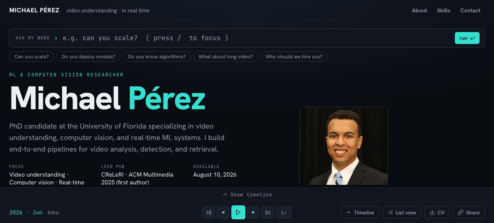

# michaelfperez.com — "THE CUT"

My portfolio, built as a video editor. Live at **[www.michaelfperez.com](https://www.michaelfperez.com)**.



I work on video understanding, so the site is an NLE timeline of my career (2018 → now) instead of a page of sections. Drag the playhead and the monitor above shows whatever existed at that moment — publications with PDF previews, projects with media, and concurrent roles and degrees in a fixed rail. Press <kbd>Space</kbd> and it plays.

## Features

- **Scrubbable timeline** — experience / research / project tracks over education eras, with temporal zoom (wheel, pinch, or buttons), drag-to-resize, and collapse. Clips are packed into sub-rows once over the full span, so nothing jumps between rows as you zoom or pan.
- **"Ask my work"** — a query console that types out answers with clickable citations that scrub the timeline to the evidence. Retrieval is deterministic and fully local: curated topics plus synonym-aware weighted keyword search over the whole record. **No LLM, no API key, nothing leaves the page** — the HUD shows the real matched tier and measured latency.
- **Tag filtering** — click any chip on a card (PUBLICATION, FIRST AUTHOR, a skill, a role tag) to see everything sharing that tag as a grid, with the matches lit up in the timeline.
- **Deep links** — `#clip/<id>`, `#q/<query>`, `#tag/<value>`, and section hashes restore the exact view on load; a Share button copies the current link. Open Graph / Twitter Card meta with a generated hero image for link unfurls.
- **List view** — the entire record as a plain, semantic, screen-reader-friendly document, one click away at all times (top nav and transport bar).
- **Accessibility** — the playhead is an ARIA slider with keyboard scrubbing, WCAG AA contrast throughout, `focus-visible` on all controls, and `prefers-reduced-motion` respected.

## How it works

Plain React 18 + Vite. No state, routing, or styling libraries — one reducer, one CSS file.

| Module | Role |
| --- | --- |
| [`src/data/content.js`](src/data/content.js) | Single source of truth for all content (publications, roles, projects, skills) |
| [`src/redesign/timelineData.js`](src/redesign/timelineData.js) | Maps content onto a decimal-year axis: interval packing, era bands, pause ranges, nearest-clip lookup |
| [`src/redesign/storeCore.js`](src/redesign/storeCore.js) | Pure reducer for the whole app — playhead, zoom window, playback, query state, tag filter |
| [`src/redesign/retrieval.js`](src/redesign/retrieval.js) | The local query engine: curated answers, synonym expansion, weighted search, citation tokenizer |
| [`src/redesign/Timeline.jsx`](src/redesign/Timeline.jsx) | The timeline surface: ruler, tracks, playhead, tooltips |
| [`src/redesign/Monitor.jsx`](src/redesign/Monitor.jsx) | The monitor: query console, answer rendering, cards, rails, panels |

## Run it

```bash
npm install
npm run dev      # local dev server
npm run build    # production build to dist/
npm run deploy   # build + publish to GitHub Pages
```
